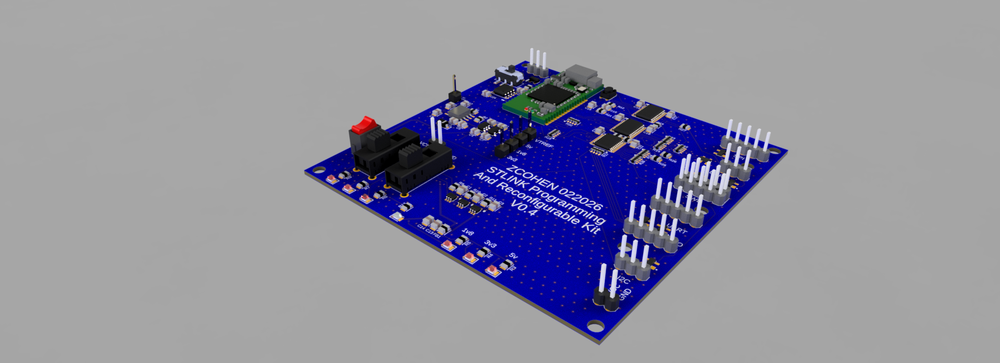

<!-- SPDX-License-Identifier: CERN-OHL-S-2.0 -->

# SPARK — STLINK Programming and Reconfigurable Kit




*CAD render of the V0.4 layout. No photograph of a fabricated board is published
in this repository yet.*

**Purpose.** SPARK is a hardened breakout and target-interface board that sits
between an [STLINK-V3MODS](https://www.st.com/en/development-tools/stlink-v3mods.html)
debugger/programmer and a target under bring-up. It adds protected power entry,
independently switched target rails, per-bus level translation, and per-line ESD
and series protection, so a mis-wired or misbehaving target is contained at the
interface instead of damaging the probe. It is intended for lab and educational
use.

**Current version:** V0.4 (see [`CHANGELOG.md`](CHANGELOG.md); the CHANGELOG also
tracks it as `rev-0.4`).

**Status: Prototype / beta hardware in bring-up.** The design is complete in this
repository — schematic, 4-layer PCB layout, BOM, and a manufacturing (ODB++)
package. **Nothing on the board has been electrically verified in this
repository, and no measurement records are published.** See
[Status](#status) for a per-stage breakdown.

---

## ⚠️ Critical power / VTREF warnings

Read these before connecting SPARK to anything.

- **VTREF ≤ 3.6 V.** V0.4 has **no** VTREF overvoltage protection or disconnect in
  hardware. A target that drives VTREF above 3.6 V is outside the design policy
  and can damage the level translators. (VTREF OVP is a named V1 goal — see
  `CHANGELOG.md`.)
- **`5V_TARGET` is power only.** Its availability does **not** make any debug or
  data pin 5 V tolerant. Do not connect 5 V logic to interface pins.
- **Target rails default OFF.** `1.8V_TARGET`, `3.3V_TARGET`, and `5V_TARGET` are
  held off by hardware pulldowns on the load-switch enables. Powering a target is
  a deliberate action.
- **First power-on uses a current-limited bench supply.** Follow
  [`validation/bring_up.md`](validation/bring_up.md) — power-off checks first,
  then a current-limited ramp, then rail and VTREF measurements.
- **This is lab / reference hardware, not a qualified product.** SPARK has not
  been through EMC, safety, environmental, or production qualification, and no
  target-compatibility testing has been recorded. Use it accordingly.

---

## Key architecture

Debugger-side conditioning, internal logic rails, and exported target power are
kept separate. Full detail: [`docs/architecture.md`](docs/architecture.md),
[`docs/interfaces.md`](docs/interfaces.md).

- **Protected 5 V entry:** STLINK `5V_OUT` enters through a TPS2596-family eFuse
  (BOM: `TPS259620DDAR`) before becoming SPARK's master 5 V rail. `FAULT`/`PG`
  telemetry is available if routed in the schematic implementation.
- **Internal logic rails:** dedicated low-noise LDOs generate internal 1.8 V and
  3.3 V logic rails, separate from anything exported to a target.
- **Switched target rails:** `1.8V_TARGET`, `3.3V_TARGET`, `5V_TARGET` are gated by
  **TPS22919** load switches with hardware default-OFF enables.
- **Hybrid level translation:** **LSF0108** for open-drain buses (I²C), **SN74AXC8T245**
  for push-pull / higher-bandwidth signals (SWDIO, SPI, UART, GPIO/SWO as
  implemented).
- **Per-line protection:** 22 Ω series resistor and **SP0503BAHTG** ESD array,
  clamped to GND, on every external-facing signal line.
- **CAN FD:** **TCAN1051** transceiver with switch-selectable 120 Ω termination.
- **PCB:** 4-layer controlled-impedance stackup (JLC04161H-7628), 88.9 mm × 88.9 mm
  enclosure-driven outline.

### Translation architecture (hybrid)

| Signal / bus | Translator | Notes |
|---|---|---|
| I²C | LSF0108 | Open-drain; pull-ups on both sides; SPARK-side pull-ups DNI by default. |
| SWDIO | SN74AXC8T245 | Push-pull path (not LSF0108). |
| SPI | SN74AXC8T245 | Push-pull / high-bandwidth path. |
| UART | SN74AXC8T245 | Push-pull path for robust edge control. |
| GPIO / SWO (as implemented) | SN74AXC8T245 | Push-pull / high-bandwidth channels. |

### Protection strategy (V0.4)

- TPS2596-family eFuse on the 5 V entry path
- TPS22919 target-rail gating with default-OFF hardware pulldowns
- 22 Ω series resistor on every external-facing signal line
- SP0503BAHTG ESD arrays on external signals, clamped to GND

### CAN interface

- CAN FD transceiver: **TCAN1051**
- 120 Ω bus termination controlled by a switch
- CAN TVS selection must be automotive-rated for the expected surge/transient
  environment; the specific TVS part is **not yet finalized**.

### PCB and mechanical notes

- 4-layer controlled-impedance stackup: JLC04161H-7628
- Heavy ground flooding with via stitching
- Typical trace width: 12 mil
- ENIG finish with ink-plugged vias
- Board size: 88.9 mm × 88.9 mm (enclosure-driven), with reinforced mounting holes

---

## Design artifacts and documents

| Item | Location |
|---|---|
| Schematic source (Autodesk Fusion Electronics) | [`hardware/schematic/SPARK Schematic.fsch`](hardware/schematic/SPARK%20Schematic.fsch) |
| PCB layout source (Autodesk Fusion Electronics) | [`hardware/pcb/SPARK PCB.fbrd`](hardware/pcb/SPARK%20PCB.fbrd) |
| Design archive | [`hardware/pcb/Electronics Design.f3z`](hardware/pcb/Electronics%20Design.f3z) |
| Bill of Materials — machine-readable | [`bom/bom_master.csv`](bom/bom_master.csv) |
| Bill of Materials — readable summary | [`bom/bom_readable.md`](bom/bom_readable.md) · [`bom/sourcing_notes.md`](bom/sourcing_notes.md) |
| Manufacturing package (ODB++) | [`hardware/fabrication/`](hardware/fabrication) · [`hardware/outputs/odb++/`](hardware/outputs/odb%2B%2B) · notes: [`hardware/README.md`](hardware/README.md) |
| Bench validation plan | [`validation/test_plan.md`](validation/test_plan.md) |
| First-power-on bring-up and known limits | [`validation/bring_up.md`](validation/bring_up.md) |
| Board renders | [`images/spark-board-perspective.png`](images/spark-board-perspective.png) · [`images/spark-board-top.png`](images/spark-board-top.png) |
| Portfolio case study | <https://portfolio.zcohen-nerd.com/projects/stlink-v3mods/> |

> **Manufacturing package note:** the fabrication archives and the
> `hardware/outputs/odb++/` tree contain **ODB++ only**. RS-274X Gerbers and
> Excellon drill files are **not currently exported**. See
> [`hardware/README.md`](hardware/README.md).

---

## Status

Maturity is tracked per stage. A stage is only marked **Yes** where an artifact
in this repository supports it.

| Stage | State | Evidence in this repository |
|---|---|---|
| **Designed** (schematic, PCB, BOM, fab output) | **Yes** | `hardware/schematic/`, `hardware/pcb/`, `bom/bom_master.csv`, `hardware/fabrication/` (ODB++). ERC/DRC status is not published. |
| **Fabrication package produced** | **Yes** | ODB++ package present. Gerber/Excellon not exported. |
| **Fabricated** (bare boards ordered/received) | **Not documented here** | No fab order, receipt, or bare-board photo in this repository. (The portfolio case study reports beta PCBs received.) |
| **Assembled** (populated board) | **Not documented here** | No assembly photos, notes, or rework log in this repository. |
| **Electrically verified** (power-on, rail voltages, VTREF, continuity) | **No** | No measurements recorded. Procedure defined in `validation/bring_up.md`. |
| **Firmware-supported** | **N/A** | SPARK carries no programmable device. The attached STLINK-V3MODS runs STMicroelectronics firmware; SPARK adds no firmware. |
| **Bench-validated** (per `validation/test_plan.md`) | **No** | Test plan defined; `validation/results/` contains no completed records. |
| **Field / long-duration validated** | **No** | Not started. No qualification, EMC, environmental, or endurance data. |

Version numbering follows `rev-X.Y` (see `CHANGELOG.md`); the current design is
`rev-0.4` / "V0.4".

---

## Repository structure

```text
SPARK/
├── hardware/
│   ├── schematic/     SPARK Schematic.fsch
│   ├── pcb/           SPARK PCB.fbrd, Electronics Design.f3z
│   ├── fabrication/   ODB++ archives (.zip/.tar/.tgz)
│   ├── outputs/       ODB++ tree; assembly/ and drill/ are placeholders
│   └── 3d/            placeholder
├── bom/               bom_master.csv, bom_readable.md, sourcing_notes.md
├── docs/              architecture.md, interfaces.md
├── validation/        test_plan.md, bring_up.md, results/ (templates only)
├── images/            board renders (CAD, not photos)
├── manufacturing/     placeholder (see hardware/ for the real package)
├── compliance/        placeholder — no compliance work performed
└── archive/           placeholder
```

Directories marked *placeholder* contain only a `.gitkeep` and no deliverable
yet.

---

## Bill of Materials

- Machine-readable master: [`bom/bom_master.csv`](bom/bom_master.csv) (46 line
  items, 102 placements).
- The BOM is derived from a schematic export intake file (kept under a local,
  git-ignored `Inbox/` during import).
- **Known data gaps:** many rows are missing `Manufacturer` / `Manufacturer Part
  Number`, and a few `Value` fields are duplicated strings from the export. These
  are catalogued in [`bom/sourcing_notes.md`](bom/sourcing_notes.md) and must be
  resolved during sourcing — do not infer missing data.
- Any part substitution must be recorded in [`CHANGELOG.md`](CHANGELOG.md).

---

## Contributing and reporting

- [`CONTRIBUTING.md`](CONTRIBUTING.md) — how changes are proposed for a
  single-maintainer, Fusion-Electronics project.
- [`SECURITY.md`](SECURITY.md) — how to report a design fault, hazard, or
  licensing problem.

## Releases

No GitHub release has been published, by intent. The design is still moving and
key boundaries are open (BOM data gaps, ODB++-only outputs, zero recorded
measurements). A tagged release is recommended only once a defensible snapshot
exists — see the "Releases" guidance at the end of
[`CONTRIBUTING.md`](CONTRIBUTING.md).

## License

SPARK is licensed under the **CERN Open Hardware Licence Version 2 — Strongly
Reciprocal (CERN-OHL-S-2.0)**. The full text is in [`LICENSE`](LICENSE).

- SPDX identifier: `CERN-OHL-S-2.0`
- Source Location (per the licence): <https://github.com/zcohen-nerd/SPARK>
- The licence is strongly reciprocal: if you make and distribute a product based
  on this design, or distribute a modified design, you must make the complete
  source (schematic, layout, BOM, and manufacturing files) available under the
  same licence and retain the notices.
- Third-party components listed in the BOM are covered by their own
  manufacturers' terms and datasheets.
